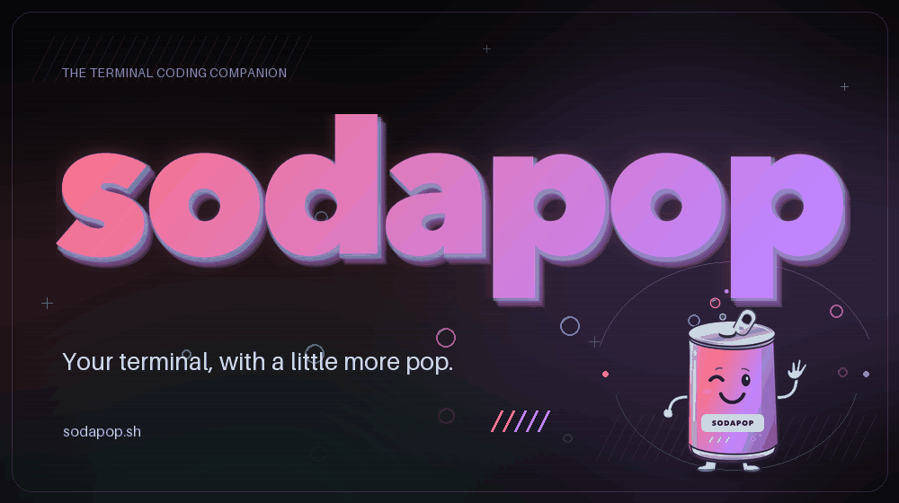
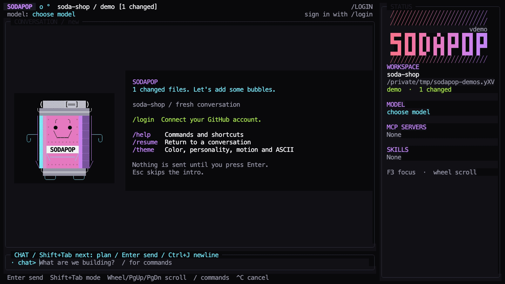
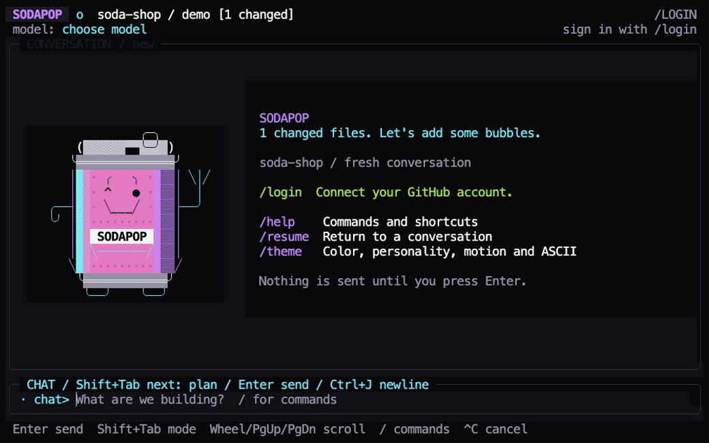
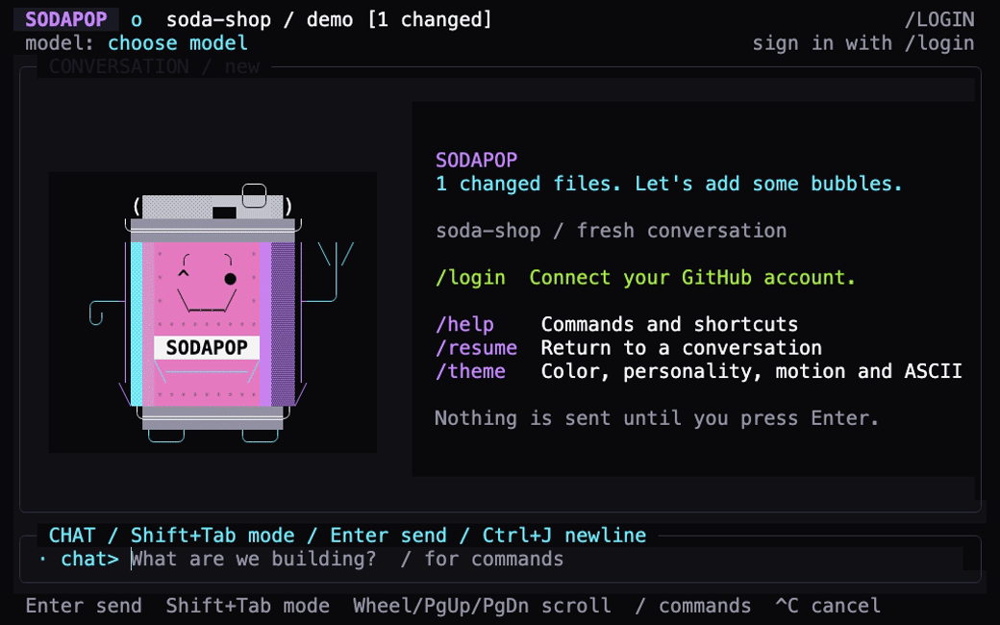

# Sodapop

<p align="center">
  <a href="images/sodapop-title.png">
    <picture>
      <source media="(prefers-reduced-motion: reduce)" srcset="images/sodapop-title.png" />
      
    </picture>
  </a>
</p>

A little can of "let's build that." Sodapop is an independent terminal coding companion, built with Go and Charm and powered by the GitHub Copilot SDK.

[Website](https://sodapop.sh) | [Source](https://github.com/VeVarunSharma/sodapop)

Bring a project: run `sodapop` from its directory to explore code, compare approaches, work through a change, and inspect or taste-test the evidence. Type `/` to find every command, or open `/vending-machine` for a curated shelf of workflows and settings. Tool activity streams alongside your conversation; edits and shell commands need approval by default. Sodapop provides its own interface and OAuth onboarding; it does not wrap the Copilot CLI's screen or fork Crush.

<p align="center">
  
</p>

[View a still image](docs/assets/demos/overview.png). This local-only demo uses prepared Git changes and stays signed out; no AI responses are simulated.

The welcome panel introduces Sodapop's happy soda-can mascot: it lifts its pull tab, pops open, and releases foam and rising bubbles before settling into a smile. The roughly 2.4-second animation runs once per launch alongside background startup, never blocks the composer, and does not imply that Copilot is connected. Type, paste, or press Esc to skip it without losing input; Ctrl+C keeps its normal cancel/exit behavior. Dialogs and errors take priority. Smaller terminals automatically animate a compact version of the same opening sequence, terminals too small to fit the mascot use text-only guidance, and reduced motion shows the resting pose immediately. Use `--no-banner` to keep the text-only welcome panel.

## Build and run

Development requires Go 1.27.1 or later, Git, and network access to fetch the pinned dependencies and runtime. Node.js 18 or later is also needed for npm distribution checks and package generation. The six supported targets are macOS (`darwin/arm64`, `darwin/amd64`), glibc-based Linux (`linux/arm64`, `linux/amd64`), and Windows (`windows/arm64`, `windows/amd64`).

```sh
make build
make start
```

The build downloads the explicitly pinned Copilot runtime, verifies the upstream asset checksums, and embeds it. End users of the resulting executable do not need Go, Node.js, or an existing Copilot installation.

On Windows ARM64 or x64, run `bash scripts/build.sh` from Git Bash and launch `bin/sodapop.exe`. Windows release packaging likewise uses `bash scripts/package.sh`; `make install` remains the Unix local-install helper.

`make start` rebuilds and launches Sodapop; `make run` is an alias. Both use `SODAPOP_OUTPUT` when set, otherwise `bin/sodapop`. Run `make help` to list the available development commands. For local OAuth configuration, copy `.sodapop.env.example` to `.sodapop.env` and set only `SODAPOP_GITHUB_CLIENT_ID` to the project's existing public GitHub OAuth Client ID. The ignored `.sodapop.env` file is loaded automatically by the Makefile, not by direct script invocations or the installed executable.

To install the command into your user bin directory:

```sh
make install
export PATH="$HOME/.local/bin:$PATH"  # If this directory is not already on PATH.
sodapop
```

`SODAPOP_INSTALL_DIR` overrides the installation directory. Relative paths resolve from the repository root; the installer prints an absolute directory for PATH setup. Installation does not edit your shell profile.

## Install the stable release

The current public release is
[`v0.1.2`](https://github.com/VeVarunSharma/sodapop/releases/tag/v0.1.2).
Its native archives are available from that release, and the npm launcher is
published under the `latest` dist-tag:

```sh
# npm launcher (macOS, glibc-based Linux, and Windows ARM64/x64)
npm install --global @sodapop-sh/cli@latest

# Windows ARM64/x64: download the matching .zip from the GitHub Release,
# verify its .sha256 sidecar, then extract sodapop.exe into a PATH directory.
```

Homebrew is **not published yet**. The tap remains gated on a signed, notarized,
owner-qualified stable release; do not use or redistribute a generated formula
as if it were public. Direct archives remain available for every supported
platform. Package-manager installs do not require Go or a separate Copilot
installation; the npm launcher does require Node.js. The exact asset, checksum,
manifest, and installed-command checks are defined in
[distribution testing](docs/distribution.md). The core Windows ARM64 release ZIP
and `@sodapop-sh/windows-arm64` npm package are supported. ARM64 MSI, WinGet, and
Scoop delivery remains separately gated until those installer paths are natively
qualified; generated installer metadata alone does not mean a public channel is available.
See [Windows delivery](packaging/windows/README.md) for verified ZIP extraction,
per-user MSI recipes, and WinGet/Scoop manifests.

### Native sign-in prerequisite

Sodapop uses its **own registered GitHub OAuth client**, with device flow enabled. Configure its **public Client ID** at launch:

```sh
export SODAPOP_GITHUB_CLIENT_ID="your_registered_public_client_id"
sodapop
```

A distributor can set the same variable at build time to bake the public ID into the executable. **Never supply a client secret or access token in this variable.** Do not copy another application's client ID.

Sign-in stays inside Sodapop: it displays a verification code/link and waits while you authorize in the browser. Sodapop stores credentials in the macOS Keychain, Linux Secret Service, or Windows Credential Manager. Session-only sign-in is an explicit alternative when secure persistence is unavailable; there is no plaintext fallback.

GitHub sign-in and Copilot access are separate. If Copilot access is unavailable, Sodapop keeps your account, draft, and local commands available. Open `/login` for **Get Copilot**, usage/billing guidance, or **Check access again**, depending on the failure. Plan links open only when selected, and access rechecks are manual: no failed prompt is replayed. An eligible Free plan is not treated as missing a paid subscription; organization policy, credentials, quota, and connectivity have distinct recovery guidance.

**Current release gate:** a Sodapop-owned client ID and a successful real Copilot entitlement/session check are required before native sign-in can be considered qualified. Without a client ID, the interface and local commands remain available, but the application does not pretend to be connected. See [authentication setup](docs/authentication.md).

## Commands

Type `/` to discover commands, then filter, navigate with arrows, and complete with Tab.

| Command | Purpose |
|---|---|
| `/help [command]` | Commands and keyboard shortcuts |
| `/login` | Sign in to GitHub or reconnect Copilot |
| `/logout` | Sign out while keeping conversation history |
| `/model [id]` | Choose an available Copilot model |
| `/clear` | Abandon the current conversation and start fresh without deleting history |
| `/resume [id]` | Resume a Sodapop session for this account and project |
| `/context` | Show context-window token usage and visualization |
| `/compact [focus instructions]` | Summarize older model context while keeping the visible transcript |
| `/plan [prompt]` | Enable advisory planning; `/plan off` returns to ordinary conversation |
| `/fizz [topic]` | Generate one burst of ideas, trade-offs, and a recommended direction |
| `/taste-test [focus]` | Validate conversation changes and report passed, failed, and unverified evidence |
| `/vending-machine` | Browse curated Sodapop workflows, settings, and extension actions |
| `/autopilot` | Automatically approve tool requests in this conversation; `/autopilot off` restores prompts |
| `/mcp [add\|enable\|disable\|remove\|reconnect] ...` | Manage explicit account-scoped stdio MCP servers |
| `/skill [trust\|add\|enable\|disable\|remove] ...` | Install immutable skills and enable them for this project |
| `/diff [all\|staged\|unstaged\|session]` | Inspect the working tree or changes observed during this conversation |
| `/theme [name]` | Appearance, contrast, motion, and personality preferences |
| `/exit` | Shut down gracefully |

### Built-in workflows

Too many ideas? Excellent. `/vending-machine` opens a curated launcher grouped
into Create, Inspect & Validate, Customize, and Connect & Extend. It does not
replace Ctrl+P, which remains the complete local action palette.

`/fizz` sends a one-shot ideation prompt that requests distinct approaches,
trade-offs, risks, and a recommendation without beginning implementation. This
is model guidance rather than a read-only safety boundary: normal approvals and
Autopilot still apply.

`/taste-test` uses bounded conversation-baseline evidence to ask the current
model for focused, report-only validation. Checks run through normal approvals,
and the workflow instructs the model not to edit or automatically fix failures.
Missing, partial, or truncated session evidence is disclosed instead of silently
falling back to the whole working tree. Perfect Pour still requires observed,
successful validation commands; a positive model narrative is not sufficient.

### Conversation, models, and changes

Planning is **advisory, not read-only**: normal tool approvals still apply. The ordinary diff views include pre-existing changes, not only changes made by Sodapop. `/diff session` compares the current tree with the conversation baseline; it reports observed changes without claiming whether Sodapop, you, or another process made them. Opening Sodapop starts fresh; resuming is always explicit.

Conversation baselines retain complete tracked files up to 64 KiB each, 16 MiB
of content total, and 1,024 files. Oversized files and other excluded paths do
not cause a startup error; `/diff session` identifies partial coverage and lists
bounded exclusion details. No changes in captured files does not mean excluded
files are unchanged. Normal whole-working-tree diff modes are unaffected.

`/compact` asks the current model to summarize older conversation context and may consume model tokens. Optional focus instructions tell the summary what to preserve. Sodapop keeps the rendered transcript visible and reports the context reduction when compaction completes.

`/model` opens a responsive Model, Context, and Thinking table. Up/Down changes
the model, Tab or Shift+Tab changes context size, and Left/Right changes
thinking effort. The selected row updates immediately, while Enter applies the
complete selection and Esc discards it. Narrow terminals stack Context and
Thinking beneath the selected model rather than hiding those settings.

### Connect and extend

Bring the right extras, not the whole attic. MCP servers are opt-in and
account-scoped. Add a disabled server with `/mcp add <name> <JSON>`, enable it
explicitly, then run `/mcp reconnect` to apply the new engine configuration.
JSON accepts `command` and optional `args`, environment-variable names in `env`,
tool filters in `tools`, and `timeout_seconds`. Secret values are never stored
in the MCP registry, ambient Copilot MCP configuration is not imported, and
every MCP tool call still follows the normal approval policy.

Skills are opt-in and project-scoped. Sodapop includes a disabled verification
skill and can import a Copilot-native skill directory or public Git repository.
Run `/skill trust <source>`, `/skill add <source>`, and `/skill enable <name>`.
Git sources may include `#branch`, `#tag`, or `#commit`; the resolved commit and
content digest are retained. Imported files are copied into private immutable
state, ambient Copilot skills are not discovered, and skill instructions never
bypass normal tool approvals. Activation changes start a fresh conversation.

The composer stays one line tall until a wrapped or multiline draft needs more room. Enter sends; Ctrl+J, Shift+Enter, or Alt+Enter adds a newline; and Shift+Tab cycles normal chat, advisory plan, and Autopilot modes. The composer border, prompt, and cursor are cyan with `chat>`, amber with `plan>`, and magenta with `auto>`. These modes are mutually exclusive: entering Plan restores normal approvals, while entering Autopilot leaves planning and approves tool requests automatically for the conversation. A bubble to the left of the prompt pulses while Sodapop is working (it stays still when reduced motion is on). Use the mouse wheel, PgUp/PgDown, or Alt+Up/Alt+Down to review conversation history; scrolling up pauses live-follow and Ctrl+End returns to current output. The wheel also scrolls long dialog details. Hold Shift while dragging across text to select it, then use your terminal emulator's usual copy shortcut. Escape dismisses menus, and Ctrl+C cancels active work. Use `/login` for account actions, `/logout` to sign out, and `//` at the start of a message to send a literal leading slash rather than a command. The in-app help describes available actions.

### Watch: workflows and composer modes

<p></p>

[Static workflow-launcher image](docs/assets/demos/commands.png). The signed-out recording shows discovery and mode changes, not a live model result. Planning is advisory, and Autopilot is not a sandbox.

Wide terminals show a right sidebar with a static three-row Sodapop wordmark surrounded above, below, and on both sides by colorful diagonal fields, plus independently scrollable workspace, model, MCP server, and skill details. The title and surrounding fields share a continuous pink-to-purple gradient, place the current version directly above the title, and fall back to compact or ASCII-safe art when terminal space or capabilities require it. Active-work motion remains beside the chat composer rather than in the sidebar. Green capability dots mean active and red dots mean inactive. F3 focuses the sidebar for keyboard scrolling and Esc returns to the composer. The sidebar automatically disappears when the terminal narrows so conversation and composer space always take priority.

Sodapop includes Neon Arcade, Graphite, Midnight, High Contrast, and Daylight themes. Graphite is the most restrained option; Neon Arcade keeps the product's color identity while reserving saturated color for active and semantic accents. Terminal font selection belongs to the terminal emulator rather than Sodapop; a modern monospace font with clear punctuation and Unicode coverage produces the best result.

### Watch: Neon Arcade, Graphite, and Daylight

<p></p>

[Static Daylight image](docs/assets/demos/themes.png).

`/theme` also offers quiet, playful, and extra personality modes. Personality can add light carbonation and reactions to interactions, contextual startup and recovery copy, and a bottle-cap recap in exit confirmation. The **Perfect Pour** celebration is deliberately conservative: it appears only after Sodapop recognizes a successful validation result, not merely a completed response. Reduced motion, no-color, and ASCII settings remain independent, so personality never requires animation, color, or Unicode.

## Permissions and privacy

### Watch: inspect staged and unstaged changes

<p></p>

[Static diff image](docs/assets/demos/diff.png). The example changes are prepared fixtures, not edits made by an AI session.

Only structured reads contained in the canonical project directory are approved automatically by default. File edits, shell commands, outside-project reads, and external tool access offer **Deny**, **Allow once**, and **Enable Autopilot**. Autopilot applies only to the current conversation and can be toggled with F2, `/autopilot`, and `/autopilot off`; `/allow-all` remains a compatibility alias. It does not answer agent questions. An approved shell command is **not sandboxed**.

Cancellation does not roll back completed file changes. Sodapop never automatically stages, resets, commits, or pushes the worktree.

Conversations and explicit MCP server definitions are persisted in Sodapop-scoped account state, while immutable skills and project activation live in separate private Sodapop state. Sodapop does not import your existing MCP servers, plugins, or skills. OAuth/Copilot connections use GitHub services and normal Copilot entitlement and usage rules; see [architecture](docs/architecture.md) for boundaries.

## Terminal options

```sh
sodapop --help
sodapop --version
sodapop --no-color
sodapop --reduced-motion
sodapop --ascii
sodapop --no-banner
sodapop --check-runtime
```

`NO_COLOR` is also respected. No Nerd Font is required. The runtime check performs a local process/protocol handshake without authenticating or opening a model session.

## Development and packaging

```sh
make test
make distribution-test
make coverage
make check
make runtime-smoke
SODAPOP_TARGET=linux/amd64 SODAPOP_VERSION=0.0.2 make package
```

Windows builds use `bin/sodapop.exe` by default. Cross-compilation checks build tags and packaging, but Windows ACL enforcement, session locking, Credential Manager access, and the bundled runtime handshake must run on a native Windows runner for the matching architecture.

Normal tests are credential-free. `make coverage` enforces both the committed total statement-coverage baseline and package floors for `internal/app`, `internal/engine`, `internal/skills`, and handwritten `internal/runtimebundle` code. Generated embedded-runtime sources are excluded from the runtime package floor but remain compiled and covered by native smoke checks. `make check` adds race testing and vet. Feature, bug-fix, and observable behavior changes should add or update focused tests in the same change. If the full suite genuinely raises coverage, run `make coverage-baseline` and review the baseline increase; the command refuses to keep or lower the existing value.

`make demos` regenerates the README GIFs and PNG alternatives using a pinned VHS recorder and an isolated, signed-out instance of the real UI. Use `make demos SODAPOP_DEMO=themes` to regenerate one clip. See the [recording guide](docs/vhs/README.md) for dependencies, fixture isolation, and tape editing.

`make brand` regenerates the animated title and its static alternative from the existing wordmark and mascot. This separate artwork workflow uses Pillow, not VHS or a live AI session. See [animated branding](docs/branding.md).

`make runtime-smoke` requires `make bundle` first. The release-candidate workflow runs it on every supported native target. A native-runtime handshake or cross-compilation is not a substitute for real OAuth/Copilot testing on a supported platform.

For an explicit live check using your existing Sodapop sign-in and local public-client configuration:

```sh
make qualify SODAPOP_LIVE_MODEL="your model ID or exact model name"
```

This opts in to normal Copilot usage and a disposable fixture workspace; it is never part of ordinary CI. See [live qualification](docs/live-qualification.md) for prerequisites, scope, and exact completion criteria.

`SODAPOP_TARGET`, `SODAPOP_OUTPUT`, and `SODAPOP_VERSION` control builds. The version defaults to `dev`; the output defaults to `bin/sodapop` and is also used by `make start`, `make run`, and `make install`. Packaging selects its own output in fresh temporary staging, leaving existing files in `dist/` out of the archive.

Candidate archives are named `dist/sodapop-<version>-<goos>-<goarch>.tar.gz`
on macOS/Linux and `.zip` on Windows. Each has a matching `.sha256` sidecar and
a same-named top-level directory containing `sodapop` or `sodapop.exe`.
The release manifest binds the version, commit, SDK/runtime pins, archive hash,
and executable hash. Archives retain documentation and all required license
notices; environment files and unrelated staging content are excluded.

An owned Homebrew tap can generate its formula from the checksums attached to an exact tagged release; the template and stale-formula check are documented in [Homebrew tap packaging](packaging/homebrew/README.md). This repository does not claim or configure `homebrew-core` distribution.

The tagged release workflow takes the public Client ID from the repository
Actions variable `SODAPOP_GITHUB_CLIENT_ID`. It exercises the archived commands
and package-manager installations on native runners before preparing a draft
release and exact-version channel packages. It does not bypass signing,
notarization, registry ownership, or owner approval for publication.
The separate native-candidate workflow uses explicit test-only versions and a
fixture client ID for installation mechanics, never real sign-in or publication.
Keep the existing client ID and OAuth grants; Sodapop's original code is licensed
under [MIT](LICENSE), while the bundled Copilot runtime retains its separate terms.

For a local native archive with a generated manifest:

```sh
make native-install-test SODAPOP_VERSION=0.0.2 SODAPOP_RELEASE_DIR=dist
```

After a release is actually public, exercise its unauthenticated download:

```sh
make public-download-test SODAPOP_VERSION=0.0.2
```

These commands verify and run the installed executable without an ambient
Copilot installation or sign-in. They fail when an asset or prerequisite is
missing; a fixture suite passing is not substituted for a native installation.

## Brand assets

Sodapop's visual identity pairs its smiling soda-can mascot and silver pull tab with a pink-to-purple gradient and cyan accents. Use the supplied artwork rather than a GitHub or Copilot logo to represent Sodapop.

| Use | Asset |
|---|---|
| OAuth application logo | [512 x 512 PNG](images/sodapop-oauth.png); badge background `#09090B` |
| Repository social preview | [1280 x 640 PNG](images/sodapop-repo-social.png) |
| Animated README title | [GIF](images/sodapop-title.gif) or [static PNG](images/sodapop-title.png) |
| Static wide banners | [PNG](images/sodapop-banner.png) or [SVG](images/sodapop-banner.svg) |
| Main brand image | [PNG](images/sodapop-main.png) or [SVG](images/sodapop-main.svg) |
| Transparent website mascot | [SVG](images/sodapop-mascot.svg), [PNG](images/sodapop-mascot.png), or [WebP](images/sodapop-mascot.webp) |
| Website logo | [For dark backgrounds](images/sodapop-lockup-on-dark.svg) or [for light backgrounds](images/sodapop-lockup-on-light.svg) |

The [images directory](images/) also includes browser icons, a landing-page social card, and editable vector masters. Open `images/index.html` locally for the visual gallery and usage guidance.

## Website development

The landing page and documentation hub live in the private `site/` package,
independently of the Go application and CLI installer packages:

```sh
npm --prefix site ci
npm --prefix site run dev
```

The website reuses selected documentation and artwork; it does not publish the
checkout or rebuild the bundled Copilot runtime. Its Pages workflow keeps
pre-release availability explicit and deploys only `site/dist/`. See the
[website development guide](https://github.com/VeVarunSharma/sodapop/blob/main/site/README.md)
for content, release metadata, and deployment configuration.

## Boundaries

The first release supports macOS, glibc-based Linux, Windows ARM64/x64 local coding, explicit local stdio MCP servers, and explicit bundled/local/public-Git skills. ARM64 MSI/WinGet/Scoop delivery, BYOK, remote MCP transports and OAuth, plugin management, private Git skill authentication, fleet orchestration, remote sessions, IDE integration, and automatic rollback are not included.

Sodapop is an independent application, not the official GitHub Copilot CLI. See [third-party notices](THIRD_PARTY_NOTICES.md).
