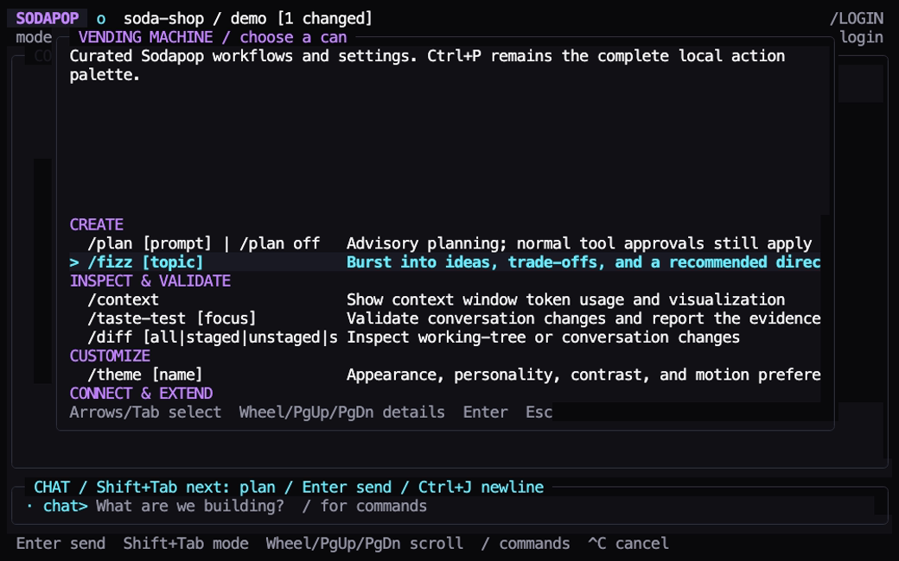

# Commands and shortcuts

The good stuff starts with `/`. Type it at the beginning of the composer to
open the command palette. Continue typing to filter, use the arrow keys to
choose, and press Tab to complete a command before adding its arguments.
`/help` and `/help command` work without signing in.

## Slash commands

| Command | Purpose |
| --- | --- |
| `/help [command]` | Show commands, usage, and keyboard shortcuts. |
| `/login` | Sign in to GitHub or reconnect Copilot. |
| `/logout` | Disconnect and sign out, keeping conversation history. |
| `/model [id]` | Choose a model available to the connected account. |
| `/clear` | Start a fresh conversation without deleting prior history. |
| `/resume [id]` | Resume a Sodapop conversation for this account and project. |
| `/context` | Show available context-window usage and its visualization. |
| `/compact [focus instructions]` | Summarize older model context while keeping the visible transcript. |
| `/plan [prompt]` | Enable advisory planning; `/plan off` returns to ordinary chat. |
| `/fizz [topic]` | Generate one burst of ideas, trade-offs, and a recommended direction. |
| `/taste-test [focus]` | Validate conversation changes and report passed, failed, and unverified evidence. |
| `/vending-machine` | Browse curated Sodapop workflows, settings, and extension actions. |
| `/autopilot` | Automatically approve tool requests for this conversation; `/autopilot off` restores prompts. |
| `/mcp [add\|enable\|disable\|remove\|reconnect] ...` | Manage explicit account-scoped stdio MCP servers. |
| `/skill [trust\|add\|enable\|disable\|remove] ...` | Manage immutable skills enabled for the current project. |
| `/diff [all\|staged\|unstaged\|session]` | Inspect the working tree or changes observed during this conversation without modifying it. |
| `/theme [name]` | Choose appearance, personality, contrast, and motion settings. |
| `/exit` | Shut down gracefully, confirming interruption when needed. |

Command names are case-insensitive. A command is recognized only at byte zero
of the composer, not after leading spaces, on a later line, or inside ordinary
text. Start a message with `//` to send one literal leading slash:
`//path` sends `/path`. Slashes elsewhere are unchanged.

## Built-in workflows

Too many ideas? Excellent. Sodapop's built-in workflows give common moments a
clear shape without creating a second permission system.

`/vending-machine` opens a curated launcher grouped into Create, Inspect &
Validate, Customize, and Connect & Extend. Selecting a can routes through the
same command handlers and busy-state checks as the slash palette. Ctrl+P remains
the exhaustive local action palette.

`/fizz` sends a one-shot ideation workflow to the selected model. An optional
multiline topic is preserved, and the response is asked to compare distinct
ideas, trade-offs, risks, and a recommended direction without implementing.
That instruction is guidance, not a read-only security boundary; tool requests
still follow normal approvals or the current Autopilot state.

`/taste-test` gathers the bounded diff observed since the conversation baseline,
adds any optional multiline focus, and asks the model to choose focused,
repository-standard checks. The workflow is report-only: it instructs the model
to diagnose failures without editing, staging, committing, pushing, publishing,
or applying fixes. Checks still use normal permissions. If baseline evidence is
missing, partial, unreadable, or additionally limited for model context, both the
UI and prompt disclose that limitation rather than silently validating the whole
working tree. A Perfect Pour appears only after recognized validation commands
actually succeed; it is not a substitute for reading the report.

## Conversation, model, and change controls

Keep the thread, lose the guesswork. These controls change how you work with the
current conversation or inspect its evidence.

`/plan` is **advisory, not read-only**. A prompt supplied after `/plan` keeps its
freeform spacing. Shift+Tab cycles Chat, Plan, and Autopilot; switching modes does
not weaken approval rules.

`/compact` asks the current model to summarize older conversation context and
may consume model tokens. Optional focus instructions describe what the
summary should preserve. The rendered transcript stays visible even though
the model's context is reduced.

`/model` opens a responsive picker with Model, Context, and Thinking columns.
Use Up/Down to choose a model, Tab or Shift+Tab to change its context size,
and Left/Right to change thinking effort. Enter applies all three values
together; Esc discards the picker draft. Narrow terminals stack Context and
Thinking directly below the selected model instead of hiding them.

`/context` shows the current agent context after a conversation starts, when the
selected model exposes a fixed context window. A model whose limit varies by
turn reports that context usage is unavailable rather than inventing a number.

`/clear` starts fresh without deleting history. `/resume` lists only the signed-in
account's conversations for the canonical project; opening Sodapop never resumes
one automatically. Starting or resuming also restores normal approval prompts by
turning conversation-scoped Autopilot off.

`/diff session` compares captured tracked files with the conversation baseline
and lists new untracked paths. Baselines retain complete files up to 64 KiB each,
16 MiB of content total, and 1,024 captured files. Oversized files, snapshot-budget
overflow, and non-regular or absent paths are excluded without a startup error.
The session diff marks partial coverage and lists up to 100 exclusions, with a
count for any remaining paths. No observed changes in captured files does not
prove excluded files are unchanged. `/diff all`, `/diff staged`, and
`/diff unstaged` still inspect the working tree, including pre-existing changes.

`/autopilot` removes per-tool prompts only for the current conversation. It
does not answer the agent's questions and turns off when you start or resume
a conversation. F2 toggles it, and `/allow-all` remains a compatibility alias.
Approved shell commands are not sandboxed. Read
[permissions and privacy](permissions-and-privacy.md) before using it.

## Connect and extend

Bring the right extras, not the whole attic. Sodapop loads only the servers and
skills you explicitly configure in its own private state.

`/mcp` lists the signed-in account's explicit servers. Add a server with
`/mcp add <name> <JSON>`; the JSON object requires `command` and may include
`args`, environment-variable names in `env`, tool filters in `tools`, and
`timeout_seconds`. New servers are disabled. Use `/mcp enable <name>` and then
`/mcp reconnect` to apply changes. Disable or remove servers with the matching
subcommands. Sodapop never imports ambient Copilot MCP configuration, never
stores the referenced environment values, and keeps MCP calls behind normal
tool approvals.

`/skill` lists installed Copilot-native skills and shows which ones are enabled
for the canonical project. Trust a local root or public Git repository with
`/skill trust <source>`, then install a skill with `/skill add <source>`.
Git sources may append `#branch`, `#tag`, or `#commit`; Sodapop records the
resolved commit. Use `/skill enable <name>` or `/skill disable <name>` to
change project activation, and `/skill remove <name>` after disabling it.
Imported files are copied into private content-addressed state, so later source
edits do not silently change the installed version. Activation changes start a
fresh conversation. Skills cannot bypass normal tool approvals.

## Availability while work is active

Help, context, theme, diff, the vending machine, Autopilot, logout, and exit
remain available while work is active. The vending machine disables selections
that are not safe to start while busy. Finish or cancel active work before
signing in, changing models, changing conversations, compacting, running Fizz
or Taste Test, changing skills, or changing planning mode.
Unavailable commands are not queued for a later automatic attempt.

## Keyboard and mouse

| Input | Action |
| --- | --- |
| Enter | Send the composer, or choose the highlighted palette/dialog action. |
| Ctrl+J / Shift+Enter / Alt+Enter | Insert a newline in the composer. |
| Shift+Tab | Cycle Chat, Plan, and Autopilot when the composer is focused and the palette is closed. |
| F2 | Toggle conversation-scoped Autopilot when no non-permission dialog is open. |
| Tab / arrow keys | Complete and navigate palette choices. |
| Esc | Close a menu or return from a focused panel. |
| Ctrl+C | Cancel active work; completed edits remain on disk. |
| Ctrl+P | Open the local action palette. |
| F1 | Open help. |
| F3 | Focus the sidebar when it is visible; Esc returns to the composer. |
| F4 | Focus tool cards; Enter or Space expands a selected card. |
| PgUp / PgDown | Scroll conversation history. |
| Alt+Up / Alt+Down | Scroll history in smaller steps. |
| Ctrl+Home / Ctrl+End | Jump to the oldest/current output. |
| Mouse wheel | Scroll conversation history or the panel/dialog under the pointer. |
| Shift + mouse drag | Select text for the terminal emulator's copy command. |
| Ctrl+Q | Open exit confirmation. |

Scrolling up pauses live-follow. Ctrl+End returns to current output and resumes
following new messages. Because Sodapop captures the mouse wheel, hold Shift while
dragging to let the terminal select text, then copy it with the terminal's usual
shortcut, such as Cmd+C on macOS or Ctrl+Shift+C on many Linux terminals. Some
terminal emulators reserve function or modified keys; the slash commands remain
the reliable alternative.

This is a still from a real signed-out UI recording. It shows local discovery,
not a live Fizz or Taste Test result. For theme identifiers and terminal flags,
see [customization](customization.md). The contributor-facing
[command catalog](../internal/commands/registry.go) is the application source
for names and parsing rules.
