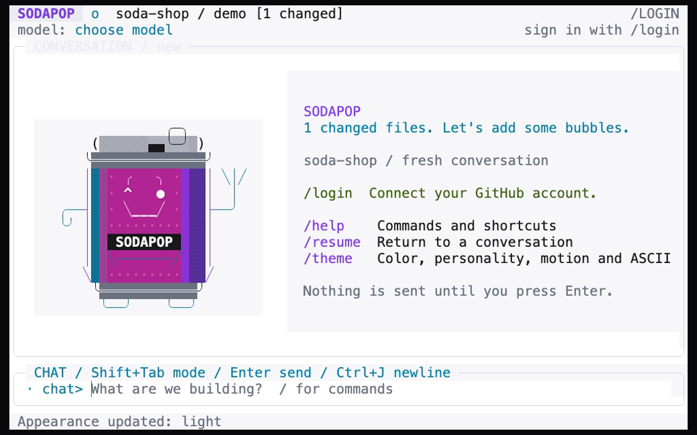

# Customization

Open `/theme` to change appearance and accessibility settings. Changes apply
immediately and are saved as Sodapop preferences. Color, motion, personality,
and the character set are independent choices.

## Themes

| Theme | Command | Character |
| --- | --- | --- |
| Neon Arcade | `/theme arcade` | Near-black surfaces with pink, purple, and cyan accents. |
| Graphite | `/theme graphite` | Restrained neutral surfaces. |
| Midnight | `/theme midnight` | Deep navy and cool accents. |
| High Contrast | `/theme high-contrast` | Strong separation on a black background. |
| Daylight | `/theme light` | Light surfaces with dark text. |



This still is from the real UI's prepared, signed-out theme recording.

## Personality and motion

The appearance menu offers Quiet, Playful, and Extra personality modes.
Personality changes UI copy and decoration, not the model's capabilities,
Copilot access, or tool-approval policy.

Reduced motion disables decorative animation and cursor blink. You can select
it in `/theme` or use a launch flag. The welcome mascot normally plays a brief
opening sequence; typing, pasting, or pressing Esc skips it without losing your
input. `--no-banner` keeps a text-only welcome panel instead.

The active-work indicator sits beside the composer. A still indicator with
reduced motion enabled does not mean the application has stopped working.

## Terminal options

```sh
sodapop --reduced-motion
sodapop --no-color
sodapop --ascii
sodapop --no-banner
```

Options can be combined:

```sh
sodapop --reduced-motion --ascii
```

`NO_COLOR` is respected when nonempty. Launch flags override the corresponding
saved display choices for that run rather than permanently changing them.
The appearance menu also offers no-color and ASCII settings when you want to
save those choices.

Choose the font and its size in your terminal emulator, not in Sodapop.
No Nerd Font is required. If box drawing or symbols look wrong, try `--ascii`.
The website uses its own reading theme; changing it does not change your
terminal application's preferences.

## Fit the workspace

The composer expands when a wrapped or multiline draft needs more room.
Wider terminals show a sidebar with workspace, model, and capability details;
the sidebar disappears on narrower screens so the conversation keeps priority.
F3 focuses a visible sidebar for keyboard scrolling.

Use [conversation navigation shortcuts](commands.md#keyboard-and-mouse) to review
long output. If a terminal reserves a shortcut, use `/help` or the action palette
to discover alternatives.

## Saved preferences

Preferences live in Sodapop's platform configuration directory, not in the
project. They include appearance and model choices, but not OAuth tokens.
Use `/theme` and `/model` instead of copying another machine's configuration
file or adding unrecognized JSON fields.

Session history is stored separately and is scoped to the account and canonical
project. See [permissions and privacy](permissions-and-privacy.md#accounts-and-local-state)
for the distinction between preferences, history, and credentials.
