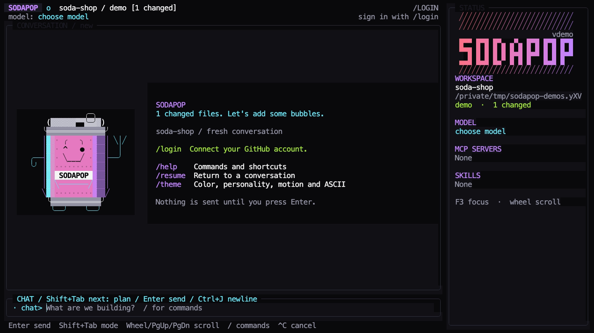

# Getting started

Sodapop is an independent terminal coding companion powered by the Copilot SDK.
It brings a conversation, tool activity, approvals, and local project views into
one terminal interface.

## Before you start

You need a supported computer, an interactive terminal, and a project directory.
Using Copilot also requires network access and a GitHub account with eligible
Copilot access under its organization policies. Signing in to GitHub and being
allowed to use Copilot are separate steps.

Start with the [download page](/download/) for current availability. Public
release and package-manager channels are enabled only when confirmed; a source
checkout is not evidence that an installer is published. The
[installation guide](installation.md) covers platforms and first-launch checks.
Contributors building from source should follow [development](development.md).

## Open your project

Change to the directory you want Sodapop to work in, then launch it:

```sh
cd /path/to/your/project
sodapop
```

On Windows, open your project directory in a terminal and run `sodapop.exe`.
Sodapop takes the current directory as its project; do not pass a project path
as a positional argument. Starting at the project root makes the intended
file-access boundary clear.

Type `/help` or just `/` to explore the interface. Local help, appearance, and
read-only Git diff views are useful even while signed out.

## Sign in inside Sodapop

1. Run `/login` in the composer.
2. Choose persistent sign-in, or explicitly choose session-only sign-in.
3. Follow the verification link and enter the device code shown by Sodapop.
4. Authorize Sodapop in your browser, then return to the terminal.
5. Wait for the separate Copilot connection result. Run `/model` to choose from
   the models available to your account.

Keep device codes private. A normal distributed application supplies Sodapop's
public-client configuration; end users do not need to register an OAuth app.
If a development or incomplete build reports a missing client ID, see
[source-build configuration](development.md#configure-source-build-sign-in),
rather than borrowing another application's identity or tokens.

Persistent sign-in uses the operating system's secure credential store.
Session-only credentials last only for the running process. If sign-in or
Copilot access fails, use [troubleshooting](troubleshooting.md#sign-in-and-copilot-access).

## Try one focused request

For a first interaction, describe a small task and the boundary you want. For
example, send this prompt:

```text
Explain how this project starts. Read the relevant files and suggest one
small improvement, but do not change files yet.
```

This is an example request, not a promised response. Read the streamed output
and tool details, and review any permission request before deciding.
Only eligible structured reads inside the project are approved automatically
by default. Edits and shell commands still need your approval.

Use `/plan` or Shift+Tab for an advisory planning focus. Planning is **not a
read-only mode** and does not replace the [permission policy](permissions-and-privacy.md).
Enter sends a message; Ctrl+J inserts a newline.

## Review and continue

Use `/diff` to inspect the entire working tree, including changes that existed
before this conversation. Ctrl+C cancels active work; it does not undo edits.
Review what changed before deciding what to keep.

`/clear` starts a fresh conversation without deleting saved history. `/resume`
lists Sodapop conversations for the current account and project. Opening
Sodapop starts fresh; history is never resumed automatically.



This still comes from a real, local, signed-out UI recording with prepared Git
changes. It does not show or simulate an AI response.

Continue with [commands and shortcuts](commands.md),
[customization](customization.md), or [permissions and privacy](permissions-and-privacy.md).
